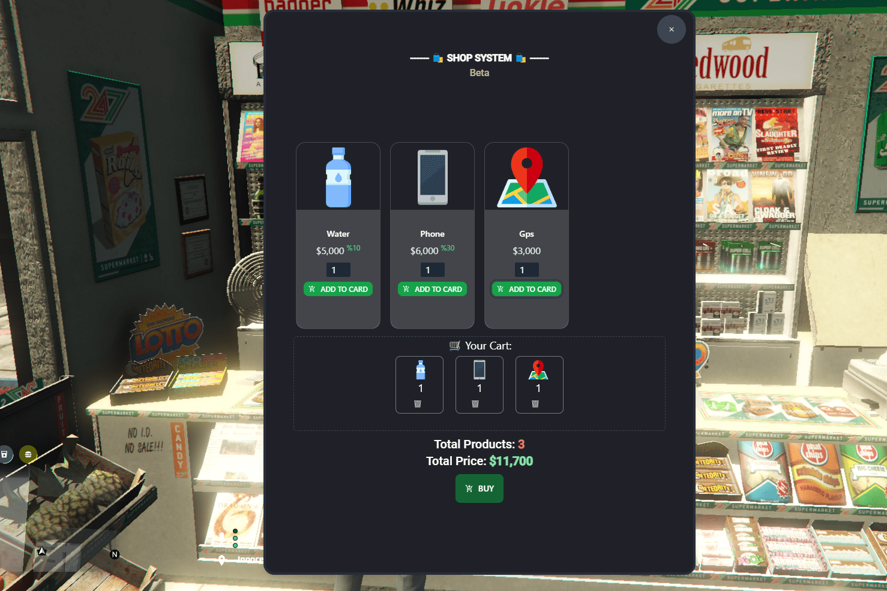
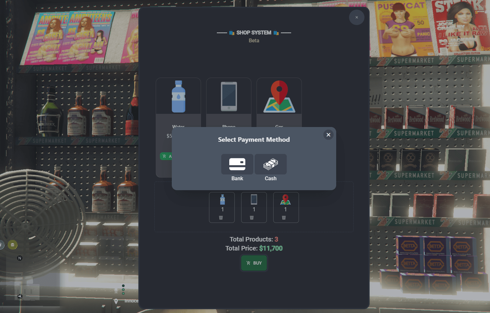
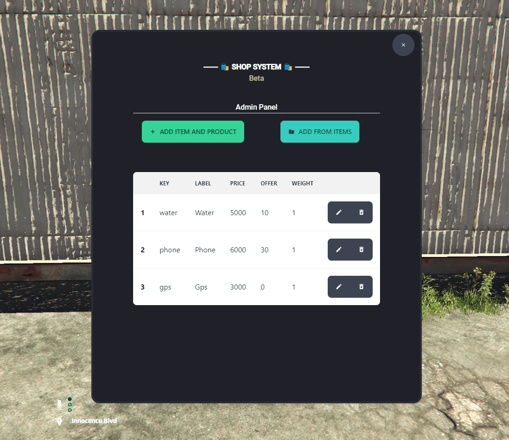
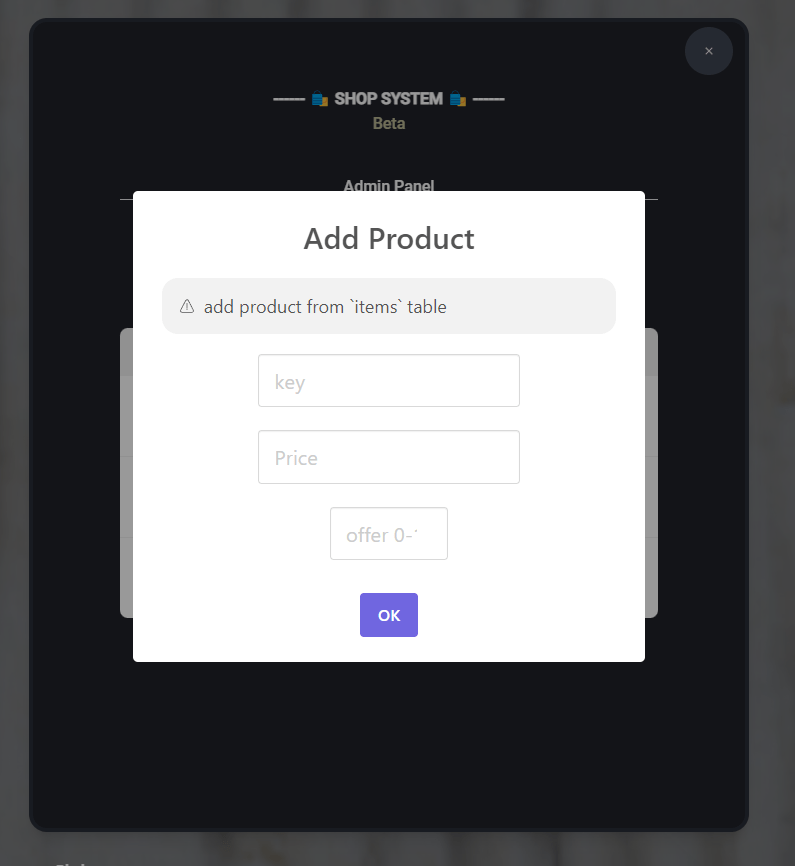

# ✍️ About


[]()

<p align="center">
    
</p>


## 🧩 Features
- **add/edit/delete product **without restart****
- **offer system**
- **admin panel**


# 🔗 requirements
- [oxmysql](https://github.com/overextended/oxmysql)
- [es_extended](https://esx-brasil.github.io/es_extended/)
- [nodejs+16](https://nodejs.org/en/download)
# 🛠️ Install
1. [Download last version](https://github.com/sajjadmrx/esx_shop_system/releases/latest/)

2. npm install
   
3. upload icons into [icons folder](./html/public/icons/)
4. open [sql file](./shop_items.sql) and run.
5. cd ./html/ && npm run build 

6. copy/paste these lines to server.cfg `server.cfg`
> ```sh
> add_ace resource.esx_shop_system command.stop allow
>
> ensure es_extended
>ensure oxmysql
>ensure esx_shop_system
>```


# commands
- `/mg_shop`
-- open admin panel


## 🖼️ Pictures
<p align="center">
    
</p>
<p align="center">
    
</p>
<p align="center">
    
</p>
<p align="center">
    
</p>
